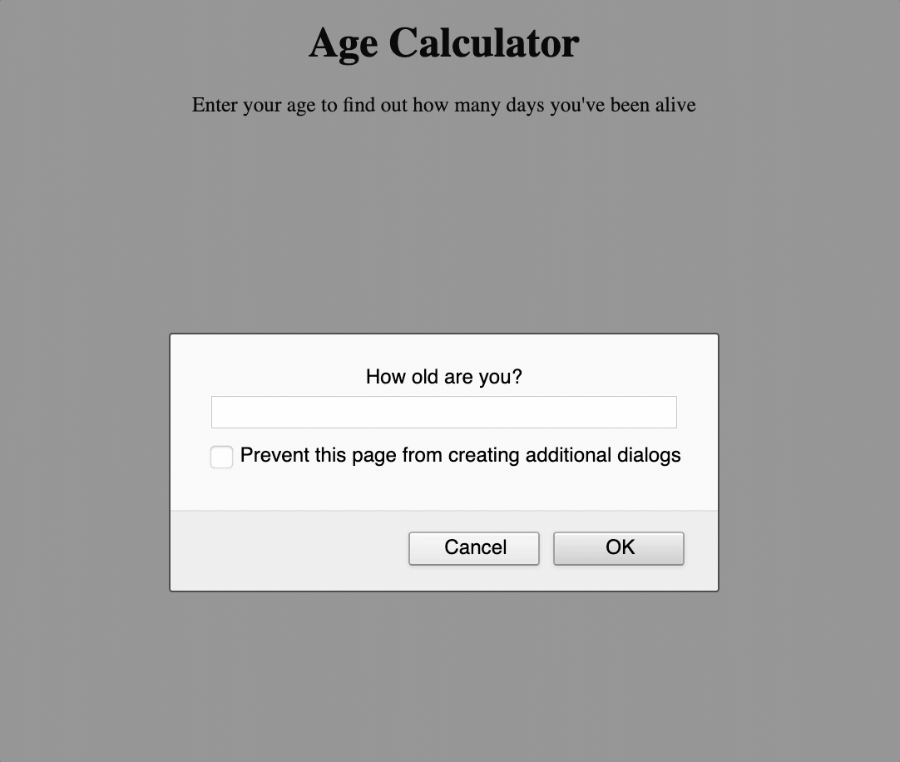

# Age Calculator

> **Deployed Page:** <https://lucasmdmartins.github.io/age-calculator/>
>
> **Author:** Lucas Martins

## Technology

**Languages, Frameworks, and Libraries:** HTML5, CSS3, JavaScript
 
**Development Tools:** Unix (zsh), Markdown, Git, GitHub, Visual Studio Code

## Description

This app asks the user for his/her current age and then calculates the approximate number of days the user has been alive (does not account for leap years). 

#### App Demo

## Installation and Development Setup

Since this project consists of a static page, there is no need to download/install any extra packages or software to run it. All you need is a basic browser and a text editor to render/edit the files.

Simply click on the deployed page link (listed above) with your preferred browser to render the HTML/CSS/JS and see the page, or open it with your text editor to make changes.

## Usage Example

Feel free to copy this code and use it as a reference for creating more intricate apps that collect user information directly on the browser and perform calculations.

## Additional Information

* **Contributing Instructions:** <https://github.com/lucasmdmartins/age-calculator/blob/master/CONTRIBUTING.md>

* **Issue Templates:** <https://github.com/lucasmdmartins/age-calculator/tree/master/.github/ISSUE_TEMPLATE>

* **Pull Request Template:** <https://github.com/lucasmdmartins/age-calculator/blob/master/PULL_REQUEST_TEMPLATE.md>

* **License:** <https://github.com/lucasmdmartins/age-calculator/blob/master/LICENSE>

* **Code of Conduct:** <https://github.com/lucasmdmartins/age-calculator/blob/master/CODE_OF_CONDUCT.md>
